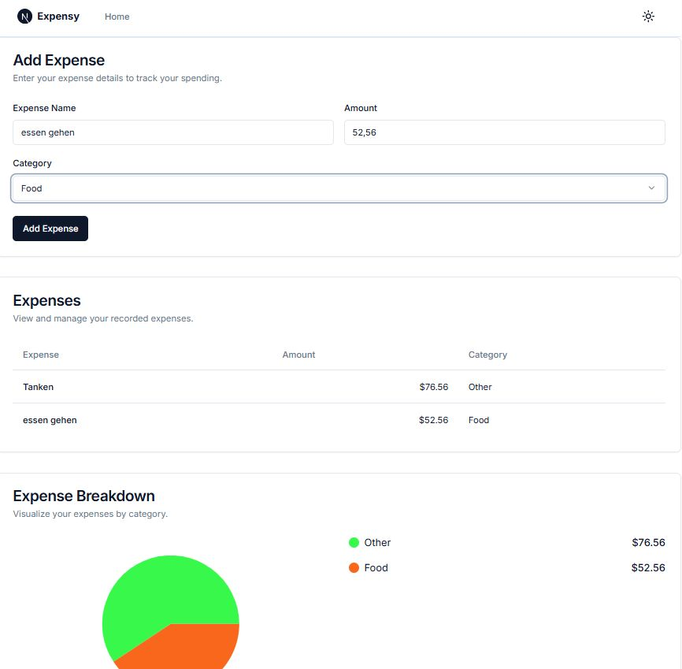

# Expensy

Expensy is a lightweight expense tracker built with a Next.js frontend and an Express backend. The app is containerized with Docker Compose and stores expense data in MongoDB, with Redis used as a short-lived cache.

## Getting started

1. Make sure Docker and Docker Compose are installed.
2. From the project root, run:

   `docker compose up --build`

3. Open the app in your browser at:

   http://localhost:3000
   
   
   
   

## Project tree

```
.
├── README.md
├── README.old
├── docker-compose.yml
├── expency_view.jpg
├── expensy_backend
│   ├── Dockerfile
│   └── ...
└── expensy_frontend
    ├── Dockerfile
    └── ...
```

## Frontend overview

The frontend is a Next.js application in expensy_frontend. It provides:

- A landing page that introduces the app and links to the main expense tracker.
- An expense dashboard where users can add a new expense, view the current list, and see a category breakdown chart.
- UI components built with Tailwind CSS and reusable shadcn-style interfaces.

The frontend sends API requests from the browser to the backend through the configured API client and environment variable for the backend URL.

## Backend overview

The backend is an Express.js service in expensy_backend. It provides:

- A `GET` endpoint to fetch all expenses.
- A `POST` endpoint to create a new expense.

The backend uses Mongoose to model and store expenses in MongoDB and uses Redis to cache the list of expenses for five minutes. When a new expense is created, the cache is invalidated so the next read fetches fresh data.

## Container interaction and data flow

The Docker Compose setup creates four containers:

- `frontend`: builds and runs the Next.js app on port 3000
- `backend`: runs the Express API on port 8706
- `mongo`: stores expense documents in persistent volume
- `redis`: stores cached expense data

Data flow:

1. The browser loads the frontend at http://localhost:3000
2. The user submits expense details in the frontend form
3. The `frontend` sends a `POST` request to the `backend API`  with a set of expenses to `/api/expenses`-endpoint
4. The `backend` creates the expense in MongoDB
5. The `backend` clears the Redis cache for expenses
6. The `frontend` refreshes its local state and shows the new entry
7. On later reads, the backend checks Redis first. If the cache is present, it returns cached data. If not, it reads from MongoDB and stores the result in Redis for five minutes
8. The frontend will asynchronously use fetchExpensesAPI  with `GET` to retrieve datasets from `backend API`  via `/api/expenses`
9. 

## Internals

## Exact locations

### New expenses are stored in MongoDB

- **Write path:** `expense.service.ts`
- **Line:** around **15–18**
- **Code:** `const newExpense = await Expense.create(expense);`

### The model used for MongoDB

- **Model definition:** `expense.model.ts`
- **Line:** around **1–25**
- **Code:** `const Expense = model('Expense', expenseSchema);`

### Where expenses are fetched from

- **Read path (cache first):** `expense.service.ts`
- **Line:** around **5–12**
- **Code:** `const cachedExpenses = await redis.get('expenses');`
- **Fallback to MongoDB:** same file, line around **13–16**
- **Code:** `const expenses = await Expense.find();`

### Request flow to those methods

1. HTTP route: `expense.route.ts`
   - `GET /expenses`→ `getExpenses()`
   - `POST /expenses`  → `addExpense(...)`
2. Controller: `expense.controller.ts`
   - `getExpenses` calls `expenseService.getAllExpenses()`
   - `addExpense` calls `expenseService.createExpense(...)`
3. MongoDB connection: `db.config.ts`
   - `mongoose.connect(process.env.DATABASE_URI!)`

### Redis is only the cache layer

- Redis usage is in `expense.service.ts`
- Redis config is in `redis.ts`

So: **real storage is MongoDB via `Expense.create()` / `Expense.find()`**, and **Redis only caches the fetched list**.

