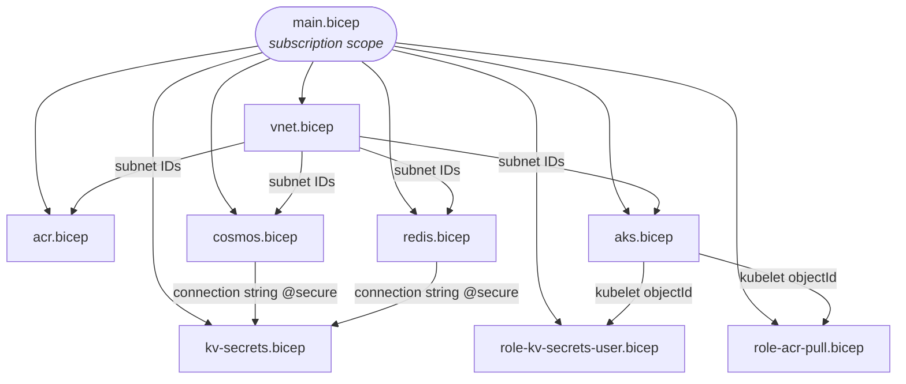
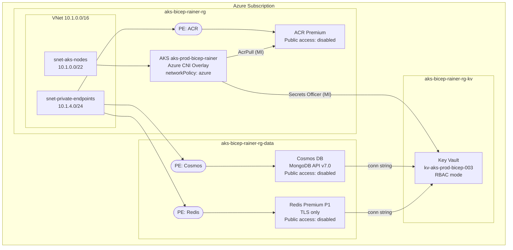
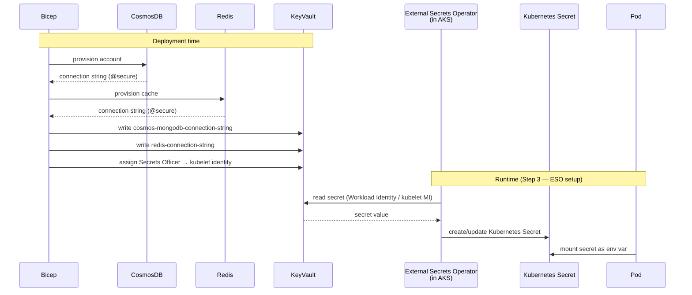

# AKS Bicep — Azure Infrastructure

Provisions the complete Azure infrastructure for the Expensy platform using a modular Bicep deployment at subscription scope. A single `az deployment sub create` call creates all resource groups, networking, compute, data services, private endpoints, and role assignments in the correct order.

> **ARM64 note:** The AKS node pools use `Standard_D4pds_v5` (Ampere Altra, ARM64). Every Docker image and Helm chart used in this cluster must support `linux/arm64`.

---

## Module Dependency Graph



---

## Files

| File | Scope | Purpose |
|------|-------|---------|
| `main.bicep` | Subscription | Entry point. Creates resource groups, calls all modules, wires outputs to inputs. Contains the deploy command in the header comment. |
| `modules/vnet.bicep` | `aks-bicep-rainer-rg` | Virtual Network `10.1.0.0/16` with two subnets: `snet-aks-nodes` (`10.1.0.0/22`) for AKS node NICs and `snet-private-endpoints` (`10.1.4.0/24`) for all private endpoints. |
| `modules/aks.bicep` | `aks-bicep-rainer-rg` | AKS managed cluster. Azure CNI Overlay, `networkPolicy:azure`, system node pool (fixed ARM64), spot user node pool with eviction taint. OIDC issuer and Workload Identity enabled. |
| `modules/acr.bicep` | `aks-bicep-rainer-rg` | Azure Container Registry, Premium SKU. Public access disabled. Private endpoint + private DNS zone `privatelink.azurecr.io`. |
| `modules/cosmos.bicep` | `aks-bicep-rainer-rg-data` | Cosmos DB for MongoDB API v7.0. Standard provisioned throughput, continuous 7-day backup. Public access disabled. Private endpoint + private DNS zone `privatelink.mongo.cosmos.azure.com`. Outputs connection string `@secure`. |
| `modules/redis.bicep` | `aks-bicep-rainer-rg-data` | Azure Cache for Redis Premium P1. TLS-only (port 6380). Public access disabled. Private endpoint + private DNS zone `privatelink.redis.cache.windows.net`. Outputs connection string `@secure`. |
| `modules/kv-secrets.bicep` | `aks-bicep-rainer-rg-kv` | Writes Cosmos DB and Redis connection strings into the existing Key Vault. Assigns `Key Vault Secrets Officer` to the deployer principal for the duration of the write. |
| `modules/role-acr-pull.bicep` | `aks-bicep-rainer-rg` | Assigns the built-in `AcrPull` role to the AKS kubelet identity on the ACR resource. Exists as a separate module because subscription-scoped Bicep cannot declare role assignments against resources in specific resource groups inline (BCP139). |
| `modules/role-kv-secrets-user.bicep` | `aks-bicep-rainer-rg-kv` | Assigns `Key Vault Secrets Officer` to the AKS kubelet identity on the Key Vault. Used by External Secrets Operator at runtime to sync secrets into Kubernetes. Same BCP139 reason as above. |

---

## Deployed Architecture



---

## Identity & Secret Dataflow

Shows how credentials flow from Azure into running pods — no secrets in Git, no secrets in CI.



---

## Prerequisites

| Tool | Minimum version | Check |
|------|----------------|-------|
| Azure CLI | 2.57+ | `az --version` |
| Bicep CLI | 0.26+ | `az bicep version` |
| kubectl | 1.28+ | `kubectl version --client` |
| An active Azure subscription | — | `az account show` |

The deploying principal needs the following on the subscription:
- `Contributor` (to create resource groups and resources)
- `User Access Administrator` (to create role assignments)

Or `Owner` covers both.

---

## Deploy

```bash
# First time only — if an existing AKS cluster is present without a custom
# VNet, delete it first (vnetSubnetId cannot be changed in-place):
az aks delete \
  --name aks-prod-bicep-rainer \
  --resource-group aks-bicep-rainer-rg \
  --yes --no-wait

# Deploy everything
az deployment sub create \
  --location eastus \
  --template-file aks_bicep/main.bicep \
  --parameters \
      location=eastus \
      suffix=rainer \
      adminUsername=azureuser \
      kubernetesVersion=1.34.7 \
      deployerObjectId=$(az ad signed-in-user show --query id -o tsv) \
      sshRSAPublicKey="$(cat ~/.ssh/id_rsa.pub)" \
  > ./current_aks.json 2>&1
```

Expected duration: **15–20 minutes** (Redis Premium P1 is the long pole at 8–12 min).

---

## Post-Deploy Verification

```bash
# AKS cluster state and network policy
az aks show \
  --name aks-prod-bicep-rainer \
  --resource-group aks-bicep-rainer-rg \
  --query "{state:provisioningState, k8sVersion:kubernetesVersion, networkPolicy:networkProfile.networkPolicy}" \
  -o table

# Both node pools present and correct
az aks nodepool list \
  --cluster-name aks-prod-bicep-rainer \
  --resource-group aks-bicep-rainer-rg \
  --query "[].{name:name, mode:mode, vmSize:vmSize, state:provisioningState, spot:scaleSetPriority}" \
  -o table

# Data resources provisioned
az resource list \
  --resource-group aks-bicep-rainer-rg-data \
  --query "[].{name:name, type:type, state:provisioningState}" \
  -o table

# Secrets in Key Vault
az keyvault secret list \
  --vault-name kv-aks-prod-bicep-003 \
  --query "[].{name:name, enabled:attributes.enabled}" \
  -o table

# Connect kubectl and check nodes
az aks get-credentials \
  --name aks-prod-bicep-rainer \
  --resource-group aks-bicep-rainer-rg

kubectl get nodes -o wide
```

---

## Known Limitations

| Item | Detail |
|------|--------|
| Cosmos DB zone redundancy | Disabled — East US has no available quota for zonal Cosmos DB accounts at time of deployment. Request via https://aka.ms/cosmosdbquota and re-enable `isZoneRedundant: true` in `cosmos.bicep` when approved. |
| Key Vault role (least privilege) | Kubelet identity has `Key Vault Secrets Officer` (read + write). Can be downgraded to `Key Vault Secrets User` (read-only) once ESO read access is confirmed sufficient. Role ID: `4633458b-17de-408a-b874-0445c86b69e0`. |
| `what-if` shallow validation | `az deployment sub create --what-if` does not catch all API-level errors (e.g. spot pool constraints, capacity issues). Treat it as a diff tool, not a validator. |
